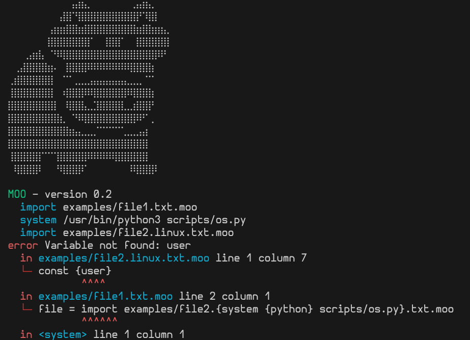

# 🐮 moo (moolang) 

*No configuration files! Only your code and the MOO-NOLITH.*

This project was created because, monoliths are lightweight,
separation of concerns is great, and splitting configuration
from code is pesky (source: me). 

Thus you can use *moo*; a tiny build system that inlines
external configurations as well as allowing packaging 
components into one file and avoid stuff like tens of API calls 
for loading a web page or platform-dependent compilation macros. 

Some of the things you can do by inlining some moo code in your files:

- Create base64 images encodings and embed them in web pages.
- Declare a virtual environment for your Python project within its main file and "run" that file without setup.
- Create a list of your favorite command line instruction in one file to call.
- Declare a build process within C code.
- Create programming language macros that make use of complicated system calls.

**Requirements:** Python 3.11 or later (no virtual environment or dependencies needed)<br>
**Author:** Emmanouil Krasanakis (maniospas@hotmail.com)<br>
**License:** Apache 2.0<br>

## 📋 Changelog

### MOO - 0.5 (nightly build)
- Loops

### MOO - 0.4 (26 March 2026)
- First stable version (changelog starts tracking from hereon)
- Test suit

## 🚀 Quickstart

Install Python 3.11 or later and download *moo.py*. You can optionally get 
some useful *scripts/* too.

You can also install the *moolang* VSCODE extension to highlight *moo* files. 
Alternate between the programming language in which you embed instructions and 
*moo* highlighting.

Instructions are placed within your text or code.
Below is an example, where `/*** code ***/` inlines that code.
Use `/**/ code` for inlining that ends at the end of the current line 
(and skips the new line character). Do note that this creates an error
because `user` is not declared anywhere yet.

```c
// hello.linux.txt.moo
Hello /*** user ***/ from a linux file!
```

Inlined expressions either have the form `varname` to evaluate
to a variable `varname = F text` or `F text`, where `F` is one 
of the builtin functions. Before running, nested 
`{expressions}` are evaluated first.
Variable names can contain dots. Here is a quick peek 
of these concepts:

```c
// hello.txt.moo
Hi!
/**/ moo.safe += const {moo.python} scripts/
/**/ os = system {moo.python} scripts/os.py
/**/ user = const maniospas
/**/ import hello.{os}.txt.moo
- Be safe out there.
```

Some basic concepts are demonstrated above:
- `+=` adds some data to a list of values. In this case, `moo.safe` determines allowed system command prefixes. More on lists and safety later.
- `system` runs a system command and captures its console output. These are scheduled as parallel processes, cached, and execute lazily. If you want to forcefully synchronize them, use `pass {variable}` to force them to evaluate and then be ignored.
- `const` acknowledges the rest of the text as a constant string value.
- `import` inlines another file. Imported files can access and shadow the variables of their callers.

Now, when built on the linux platform with *python3 moo.py hello.txt.moo* the
following file is produced by removing the *.moo* extension:

```c
// hello.txt
Hi!

Hello world from a linux file!
- Be safe out there.
```


## ⚡ About

**Variables** are immutable and inherited from where your code is included. But you can locally shadow external names. Variable names are independent of the rest of your file.

**Lists** of values that can be viewed as one huge string with a given separator between its segments. 
For example, you may have separate lists for your html style, script, and body. 
Declare a list like below, and append text to it. Lists are empty by default. 

```c
/**/ BODY = list {moo.symbols.line}
/**/ BODY += this will show in the body
<body>/***BODY***/</body>
```

**Placeholders** are means of not evaluating a list (only a list!) immediately but at the latest possible moment to let it accrue more content.Usually that place is the end of the file, but placeholders are also re-evaluated for the inputs of `do` statements. Here is an example:

```c
/**/ x = list {moo.symbols.line}
/**/ placeholder x
This is something placed after the placeholder.
/**/ x += const This is placed at the beginning.
```

**Scripts.** In addition to *moo.py*, which is a self-contained implementation for running the language without any dependencies or virtual environment, you can also get a collection of pre-installed scripts that leverage Python's impressive standard library. You can reference the python executable with the `{moo.python}` variable in your commands.

Some of available scripts are:

- *scripts/os.py* tells you the operating system currently running. This often helps tailor to the local environment.

- *scripts/b64.py* converts a file to base64 encoding.

**Safety.** In general, use `command` to run specific external commands. The `moo.safe` variable determines how the command
can be prefixed. A common default is `/*** moo.safe += {moo.python} scripts/ ***/` for allowing all contents of the *scripts/* folder
to be called by Python while preventing all other programs AND Python from being executed with code injection attacks. The assumption
is that you trust whitelisted commands and folder combinations.

You can try to append to the safety list from anywhere, but this action will
be rejected unless the ENTRANT FILE allows a superset of permissions. This is done to achieve safety. Also `..` is not allowed
within commands, so as to prevent escaping from the safety mechanism. If you want to use it, also use 
path resolution everywhere to convert relative paths to absolute ones.

**For now, `eval` remains unsafe.**

**Reuse** moo code that is packed into `const` data like below. The `do` statement works by replacing nested
statements with their expanded version and *then* properly interpreting the result. Interpretation occurs once only. 
Under this pattern, the `const` declaration works like a capturing lambda expression as it resolves
all its `{}` segments at the time of declaration. So, below we get to call the b64 Python script from with an 
appropriate argument. You can declare such helpers at the top level and have them be
shared in imported *moo* files.

```c
/**/ moo.safe += {moo.python} scripts/
/**/ b64 = const system {moo.python} scripts/b64.py
/**/ b64
/**/ do {b64} examples/file1.txt.moo
```

This will create a file like the following (the middle b64 is used to demonstrate the exact command):

```txt
system /usr/bin/python3 scripts/b64.py
LyoqKiB1c2VyID0gY29uc3Qgd29ybGQqKiovCi8qKiogZmlsZSA9IGltcG9ydCBleGFtcGxlL2Zp
bGUyLntjb21tYW5kIHtweXRob259IHNjcmlwdHMvb3MucHl9LnR4dC5tb28gKioqLwovKioqIEJP
RFkgPSByZWdpb24qKiovCi8qKiogYXBwZW5kIEJPRFkge2ZpbGV9ICoqKi8KCjxib2R5Pi8qKiog
Qk9EWSAqKiovPC9ib2R5PgoK
```

**Namespaces** are also there to compartmentalize and enable/disable parts of files.
To work within a namespace, prefix your instruction with `NAME:`, where *NAME* is its name.
You can access all namespaces declared in the same file from within each other, 
but *not* namespaces declared in other files, even if those files import the current one.
What you *can* do is call another file within a namespace to adjust what information is passed 
and return without polluting your *moo* code.
The following example demonstrates usage of a namespace, alongside a list of final features:

- `enabled` checks for a True or False value and correspondingly disables all future uses of the
namespace in the file. Do note that namespaces in other files remain unaffected, even if they 
have the same name. You can *not* re-enable a disabled namespace later.
- `eval` evaluates a subsequent Python expression
- `moo.args` is a string representation of additional arguments passed to the script.
- `schedule` runs a system command after the monolith is created. Scheduled tasks run concurrently.

Thus, if you run the following per `python3 moo.py src/main.c.moo --compile` it will compile the program.
Do note the usage of `///**/` as a pattern that allows *moo* to appear commented by C tools but also evaluates
to valid code when replaced with anything.


```c
// src/main.c.moo
///**/ COMPILE: moo.safe += gcc
///**/ COMPILE: enabled {eval "--compile" in {moo.args}}
///**/ COMPILE: schedule gcc -Wall -O3 -o lettuce src/main.c

#include <stdio.h>

int main() {
    printf("Hello world!\n");
    return 0;
}
```

**Error messages.** If something goes wrong, *moo* will create a stack trace
of its failed attempt. Do note that that lines and columns refer to the start
of *moo* blocks within your code. However, there is proper denotation of
the exact point of failure, even within nested {} blocks or expanded expressions. 
If system commands fail due to lazy execution,
their initial declaration is pointed out. Here is an example.



